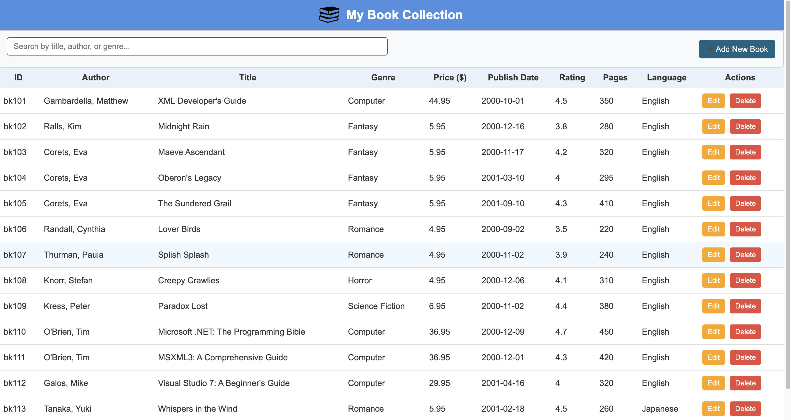
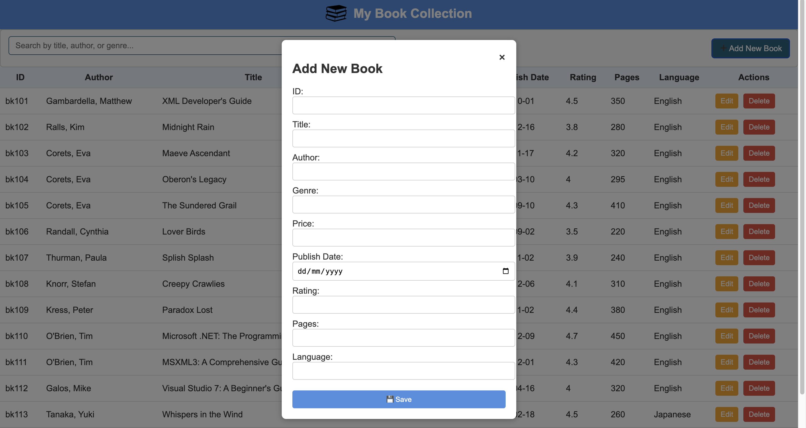

# Internet Technology Course Materials
This repository contains coding examples organized by units.

## Unit-1

### Unit-1 - Java
These Java examples demonstrate core data structures and object-oriented programming concepts. ArrayExample shows how to declare, access, modify, and display elements in a fixed-size array. ArrayListExample introduces dynamic arrays with operations like add, remove, access, and iteration. CollectionsDemo explores multiple Java Collections—ArrayList, LinkedList, HashSet, HashMap—and common operations including sorting, reversing, shuffling, and searching. ObjectExample demonstrates object creation, using constructors, methods, and modifying object properties via getters and setters. Together, these programs teach practical usage of arrays, collections, and objects in Java.

- To run Java code, first save the file with the same name as the class (e.g., Hello.java) and compile it using the command `javac Hello.java`, which generates a bytecode file (Hello.class). Then, execute the program with `java Hello` in the terminal, which runs the main() method and produces the output.

### Unit-1 - Web
These web examples demonstrate the basics of HTML, CSS, XML, and DHTML. html_basics.html introduces fundamental HTML elements like headings, paragraphs, lists, links, images, and forms. css.html along with css_example.css shows how to style HTML elements, create navigation menus, boxes, hover effects, and use media queries for responsive design. xml_example.xml demonstrates structured data representation using XML with nested elements and attributes. dhtml_example.html highlights dynamic behavior on web pages using JavaScript for content changes and toggling element visibility. Together, these examples teach both static structure and interactive client-side web development.

- A simple HTML file can be run by saving it with a .html extension (e.g., index.html) and opening it directly in any web browser to view the page. Alternatively, in VS Code, you can use the Live Server extension to run the file, which auto-refreshes the browser whenever you save changes in the code.

- There are three main ways to integrate CSS and JavaScript into an HTML file:

    1. Inline – CSS styles or JavaScript code written directly inside the HTML elements using the style attribute or the onclick/onchange attributes.

    2. Internal – Adding CSS inside a <style> tag and JavaScript inside a , which is the most common and modular approach.

- Just open the XML file directly from its saved location (e.g., double-click it), and the browser will display it in a tree-like structured view. When opened using Live Server, the XML file is still shown in the browser, but instead of the default tree-like structured view, it usually displays the raw XML text because the server serves it as plain text.

### Unit-1 – BookApp
This BookApp is a simple web-based application for managing a personal book collection. The HTML provides a structured layout with a header, a searchable table of books, and a modal form for adding or editing book details. CSS styles the page with a clean interface, responsive controls, and visually distinct buttons for edit/delete actions. JavaScript manages the book data, rendering it dynamically in the table, filtering by title, author, or genre, and handling CRUD operations through the modal form. Users can add new books, edit existing ones, delete entries, and search efficiently. Overall, it demonstrates interactive client-side web development using HTML, CSS, and JS.

## Unit-2

### Unit-2 - javascript-event-driven
#### |--> with-view
Simple web-based event driven pages built using HTML and JavaScript.

- use Live Server

#### |--> without-view
Plain JavaScript functions to perform given tasks.

- Ways to Run JavaScript Code
    1. Run in Browser Console: Open browser -> Right-click → Inspect -> Go to Console tab, paste JS code, and press Enter.

    - If pasting is blocked → type "allow pasting" first.

    2. Run with Node.js

    - Install Node.js from https://nodejs.org.

    - Verify installation in terminal:
        `node -v`   # Node.js version
        `npm -v`    # npm version

    - Navigate to project folder and run JS file:
        `node fileName.js`

### Unit-2 - dynamic-webpage
This project is a Book Catalog web application built with HTML, CSS, and JavaScript. It demonstrates two approaches: one using AJAX and Fetch API (index.html + script.js) and another using a non-AJAX synchronous approach (index2.html + script2.js). The app loads book data from XML or JSON files, parses it, and displays details. Users can search books by keywords and filter them by genre dynamically. A loading indicator and error handling are included for a better user experience.

- Simulate slow loading using Chrome DevTools → Network tab → set Throttling = Slow 3G.

- To test error handling, introduce a small error in XML/JSON and reload page.

### Unit-2-BookApp
This project is a Book Management Web App that uses HTML, CSS, and JavaScript to display and search a collection of books. Book data is stored in an external JSON file (data.json) and loaded dynamically using the Fetch API. The data is rendered into an HTML table using DOM manipulation, where each row shows Book details. A search filter is implemented with JavaScript’s filter() and includes() functions to allow real-time filtering by title, author, or genre. The project also includes a modal form structure for adding new books, though the current version works in read-only mode,since this is client-side only, changes are not saved back to data.json (you’d need a backend for that).

- When working with data.json, the browser can only fetch and filter data, but cannot directly update or delete entries since file writing requires a backend.

- If you open index.html directly via a file:// URL, fetch("data.json") will fail due to CORS/local file restrictions. To make it work, you need to run the project on a local server (e.g., Live Server in VS Code).

## Unit-3

- Attached Database dump : book_catalog.sql
- Install & Start MySQL
- Create Database & Table
- Ensure MySQL service is running:
    `mysqladmin -u root -p status`

- GUI Option – MySQL Workbench
    Install from: https://dev.mysql.com/downloads/workbench/
    Connect to local server, and then you can create database, browse tables, run SQL queries.

### Unit-3 - ConsoleBased
This project implements a console-based CRUD application in Java for managing a book catalog using JDBC with MySQL. The Book class models book attributes, while BookDAO handles database operations with PreparedStatement and SQL queries for Insert, Read, Update, and Delete. The Main class provides a menu-driven interface using Scanner for user input. Database connectivity is achieved via DriverManager.getConnection(), ensuring secure interaction with the MySQL books table. Exception handling and parameterized queries are used to prevent SQL injection and ensure reliability. Overall, it demonstrates Java OOP + JDBC integration in a practical CRUD workflow.

- Place JDBC driver (mysql-connector-j-8.3.0.jar) inside project lib/ folder. (you can place it anywhere)
 - Compile & Run with Classpath
    `javac -cp .:lib/mysql-connector-j-8.3.0.jar unit3/consoleBased/*.java`
    `java -cp .:lib/mysql-connector-j-8.3.0.jar unit3.consoleBased.Main`

 - After building the console-based application, we could extend the project by using Java’s built-in HTTP server (com.sun.net.httpserver) to expose a simple REST API. Alternatively, as a step below in abstraction, we could have implemented the same functionality using raw socket programming.

### Unit-3 - BookApp
This project is a full-stack Java web application for managing a book catalog using Servlets, JDBC, and MySQL. The web.xml file configures the BookServlet, which handles CRUD operations (GET, POST, PUT, DELETE) through HttpServlet methods. JDBC is used for secure database interaction with PreparedStatement, ensuring protection against SQL injection. Data is exchanged between frontend and backend in JSON format using the org.json library. The frontend (index.html, style.css, script.js) implements a dynamic UI with modal forms, search filtering, and asynchronous calls via the Fetch API. This demonstrates integration of Java EE (Servlets) with a REST-like API and modern JavaScript frontend for a complete web-based CRUD system.

- Check tomcat server and mysql are up and running
- Its best practice to setup a standard File Structure
- Place both JARs (jakarta.servlet-api-6.0.0.jar, mysql-connector-j-8.3.0.jar) inside WEB-INF/lib/.
- Compiled .java files with jar in class path.
- .class files must go into WEB-INF/classes/ matching the package structure.
- To create and deploy your servlet project, after compilation and creation of .class files, first navigate to the correct folder and remove or move the raw .java file so that only compiled classes remain inside WEB-INF/classes. Then, generate the WAR file, which packages your project into a deployable archive. Once the WAR is created, locate your Tomcat installation directory and copy the WAR file into the webapps/ folder. When you restart Tomcat, it will automatically unpack the WAR and make your application accessible at http://localhost:8080/YourApp.

- For Testing API / Servlet
    The Postman Desktop Agent is used to send and test HTTP requests (GET, POST, PUT, DELETE, etc.) directly to your server or REST API, without needing to build a frontend every time.

- In modern JDBC (4.0+), the driver auto-loads if JAR is on classpath. But Tomcat sometimes has classloader quirks → better to explicitly load in servlet:
    Class.forName("com.mysql.cj.jdbc.Driver");

-  Debug well, debug often. Every programmer hits bugs—sometimes the kind that steal your sleep—but great programmers know how to locate, isolate, and fix them. Treat errors as feedback, not failure: check log files, read the stack trace, add minimal test cases, and change one variable at a time. If you’re never seeing bugs, you’re not pushing your limits (or learning) enough.

- You can set JAR files in the classpath in multiple ways depending on your project setup. At the command line, you can include them during compilation and execution using the -cp option (e.g., javac -cp .:lib/mysql.jar MyProgram.java and java -cp .:lib/mysql.jar MyProgram). If you have many JARs, you can use a wildcard like -cp "lib/*". Another option is to permanently configure the CLASSPATH environment variable in your system so Java automatically finds them.
- In web projects, JARs are usually placed inside the WEB-INF/lib/ folder, while in IDEs like Eclipse or VS Code, you can add them directly through the project’s build path or library settings, which ensures the IDE recognizes external libraries during development. If this step is not done, your code may show red underlines or "cannot resolve" errors in the editor, but these are often harmless as long as the JAR is included correctly in the runtime classpath when compiling or executing the program.

## Unit-4

### Unit-4 - welcomeJSP
This is a basic JSP (JavaServer Pages) program that runs on a Tomcat server. The HTML structure is embedded within the JSP file, and when deployed, the Tomcat server compiles it into a servlet.

### Unit-4 - BookAppUsingJSP
This project implements a Book Catalog Web Application using JSP, Servlets, and MySQL. The web.xml file maps requests to BookServlet, which handles CRUD operations on the books table in MySQL via JDBC. The BookServlet processes data in JSON format and forwards results to index.jsp. The JSP page uses JSTL <c:forEach> to dynamically render book records and integrates with JavaScript (AJAX + Fetch API) for client-side filtering, editing, and deletion. The script.js manages UI interactions like modal forms, search filtering, and live updates, while style.css provides the responsive layout.

- In JSP, a Map can be passed from the Servlet using the request implicit object.

- JSTL (JavaServer Pages Standard Tag Library): A set of ready-to-use JSP tags for common tasks like iteration, conditionals, and formatting.

- EL (Expression Language): A concise syntax (${…}) in JSP to access Java objects, properties, and collections directly.

- The JSP uses JSTL <c:forEach> to loop over collections and EL ${book.id} to access individual map values directly. This combination allows clean, dynamic rendering of server-side data on the page.

### Unit-4 - jsp-with-jdbc
This JSP page directly connects to a MySQL database using the JDBC driver (com.mysql.cj.jdbc.Driver), executes a SELECT query on the books table, and dynamically displays the results in an HTML table. It runs in Tomcat with the MySQL connector JAR placed in the lib folder, representing a non-MVC structure where database logic and presentation are mixed in a single JSP.

### Unit-4 - basic-jsp
This project BookAppUsingJSP is a Java web application developed using JSP, Servlets, and JDBC, deployed on the Apache Tomcat server. The project is managed using Maven, with all dependencies (like jakarta.servlet, mysql-connector-j) configured in the pom.xml, ensuring easy build and portability. Servlets act as Controllers, handling HTTP requests and responses, while JSP pages function as Views to present data. The DAO classes use JDBC to perform CRUD operations directly on the database, serving as a lightweight data access layer. Although there is no strict Model class, the design follows a Model 2 (Servlet–JSP) structure, separating business logic from presentation. This setup demonstrates Java web development with Maven dependency management, database connectivity, and MVC-ish design.

- To create a Maven project, first install Maven and set up the project directory with all necessary files. The pom.xml file acts as the project’s configuration, managing all JARs, dependencies, plugins, and build settings automatically.

### Unit-4 - book-app-jsp-mvc
This project implements a JSP-Servlet-MVC web application for managing books using Jakarta EE 10 on Tomcat 11. The pom.xml configures dependencies for Servlet API, JSTL, and MySQL Connector/J, packaging the project as a WAR via the Maven WAR plugin. The web.xml maps /books requests to BookController, which delegates CRUD operations to BookDAO via JDBC (com.mysql.cj.jdbc.Driver) with parameterized SQL queries. The index.jsp uses JSTL <c:forEach> to dynamically render books in an HTML table, with JavaScript (script.js) handling client-side filtering and modal-based add/edit forms. This separation of DAO (data access), Controller (request handling), and JSP (view rendering) establishes a clean MVC structure.

- JSP Application with MVC is designed so that index.jsp submits forms to the controller (/books) using an action parameter instead of JSON. Since browsers cannot send DELETE requests directly from HTML forms, a hidden field _method=delete is handled in doPost to call bookDAO.deleteBook(...). 
- A redirect check at the top of index.jsp ensures it works both when accessed directly or via /books.
- The project is built as a WAR using mvn clean package -U, deployed to Tomcat, and accessible at http://localhost:8080/YourApp/.

### Unit-5

### Unit-5 - bean-example
This project demonstrates a simple Book Management Web Application using JSP, JavaBeans, and JDBC. The Book class acts as a JavaBean that encapsulates book data with private fields and public getters/setters, ensuring reusability and data encapsulation. JSP pages use this bean for data binding, while JDBC handles database operations like Insert, Update, Delete, and Fetch from MySQL. This follows the MVC (Model 1 style) pattern